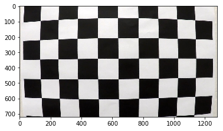
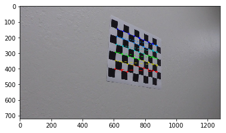
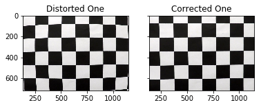
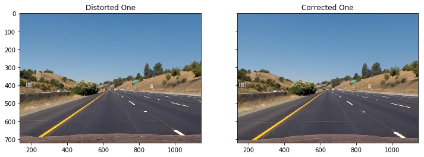
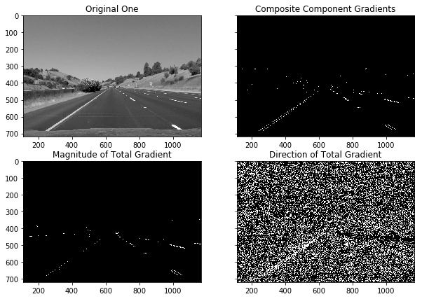
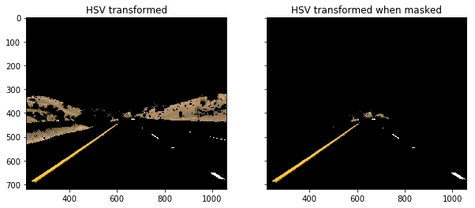
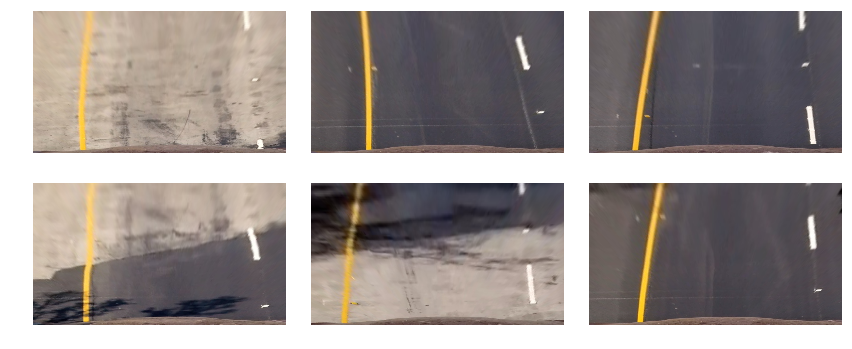
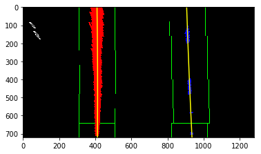
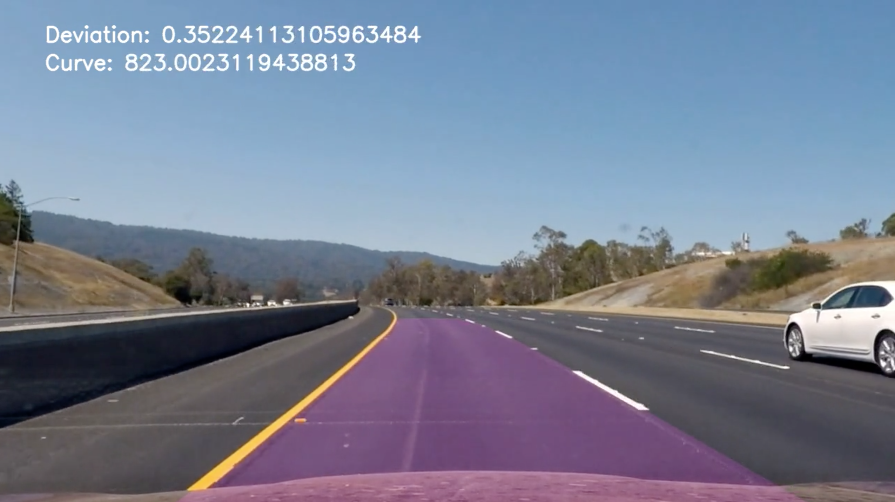

# P4 - Lane Finding - Self Driving Car  
---

**Using Advance CV techniques**

The goals / steps of this project are the following:

* Compute the camera calibration matrix and distortion coefficients given a set of chessboard images.
* Apply a distortion correction to raw images.
* Use color transforms, gradients, etc., to create a thresholded binary image.
* Apply a perspective transform to rectify binary image ("birds-eye view").
* Detect lane pixels and fit to find the lane boundary.
* Determine the curvature of the lane and vehicle position with respect to center.
* Warp the detected lane boundaries back onto the original image.
* Output visual display of the lane boundaries and numerical estimation of lane curvature and vehicle position.

[//]: # (Image References)

[image1]: ./examples/undistort_output.png "Undistorted"
[image2]: ./test_images/test1.jpg "Road Transformed"
[image3]: ./examples/binary_combo_example.jpg "Binary Example"
[image4]: ./examples/warped_straight_lines.jpg "Warp Example"
[image5]: ./examples/color_fit_lines.jpg "Fit Visual"
[image6]: ./examples/example_output.jpg "Output"
[video1]: ./project_video.mp4 "Video"


###Camera Calibration

####1. Briefly state how you computed the camera matrix and distortion coefficients. Provide an example of a distortion corrected calibration image.

The code for this step is contained in the first code cell of the IPython notebook located in "./calibrateCamera.ipynb" (or in lines # through # of the file called `some_file.py`).  

I start by preparing "object points", which will be the (x, y, z) coordinates of the chessboard corners in the world. Here I am assuming the chessboard is fixed on the (x, y) plane at z=0, such that the object points are the same for each calibration image.  Thus, `objp` is just a replicated array of coordinates, and `objpoints` will be appended with a copy of it every time I successfully detect all chessboard corners in a test image.  `imgpoints` will be appended with the (x, y) pixel position of each of the corners in the image plane with each successful chessboard detection.  

I then used the output `objpoints` and `imgpoints` to compute the camera calibration and distortion coefficients using the `cv2.calibrateCamera()` function.  I applied this distortion correction to the test image using the `cv2.undistort()` function and obtained this result: 



tested the lines with on chess board image



###Pipeline (single images)

####1. Provide an example of a distortion-corrected image.
To demonstrate this step, I will describe how I apply the distortion correction to one of the test images like this one:


and on test images for  lanes



####2. Describe how (and identify where in your code) you used color transforms, gradients or other methods to create a thresholded binary image.  Provide an example of a binary image result.
I used a combination of color and gradient thresholds to generate a binary image (thresholding steps at lines # through # in `calibrateCamera.ipynb` chunk 8 and 9 ). 
I used the overall gradient, specifically the magnitude of the total gradient  and the direction of the total gradient . 

```
def get_component_gradient_mask(image):
    sobelx = cv2.Sobel(image, cv2.CV_64F, 1, 0)
    sobely = cv2.Sobel(image, cv2.CV_64F, 0, 1)
    abs_sobel_x, abs_sobel_y = np.absolute(sobelx), np.absolute(sobely)
    #Convert the absolute value image to [0,1]:
    scaled_abs_sobel_x, scaled_abs_sobel_y = abs_sobel_x / np.max(abs_sobel_x), abs_sobel_y / np.max(abs_sobel_y)
    thresh_min_x, thresh_max_x, thresh_min_y, thresh_max_y = 0.1, 1.00, 0.35, 1.00
    sbinary = np.zeros_like(scaled_abs_sobel_x)
    sbinary[((scaled_abs_sobel_x >= thresh_min_x) & (scaled_abs_sobel_x <= thresh_max_x) == 1) & ((scaled_abs_sobel_y >= thresh_min_y) & (scaled_abs_sobel_y <= thresh_max_y) == 1)] = 1
    return sbinary

def get_magnitude_gradient_mask(image):
    sobelx = cv2.Sobel(image, cv2.CV_64F, 1, 0) 
    sobely = cv2.Sobel(image, cv2.CV_64F, 0, 1)
    abs_sobel = np.sqrt(sobelx**2 + sobely**2)
    #Convert the absolute value image to [0,1]:
    scaled_abs_sobel = abs_sobel / np.max(abs_sobel)
    thresh_min, thresh_max = 0.5, 1.00 
    sbinary = np.zeros_like(scaled_abs_sobel)
    sbinary[(scaled_abs_sobel >= thresh_min) & (scaled_abs_sobel <= thresh_max)] = 1
    return sbinary

def get_direction_gradient_mask(image, kernel_size=3, threshold=(0.7, 1.2)):
    sobelx = cv2.Sobel(image, cv2.CV_64F, 1, 0, ksize=kernel_size)
    sobely = cv2.Sobel(image, cv2.CV_64F, 0, 1, ksize=kernel_size)
    dir_sobel = np.arctan2(np.absolute(sobely), np.absolute(sobelx)) 
    binary_output =  np.zeros_like(dir_sobel)
    binary_output[(dir_sobel >= threshold[0]) & (dir_sobel <= threshold[1])] = 1
    return binary_output
    
```

 Here's an example of my output for this step.  




 
 and also masked the images and did HSV transformation to make the yellow line more appealing and can be detected even with very light background.




####3. Describe how (and identify where in your code) you performed a perspective transform and provide an example of a transformed image.

The code for my perspective transform includes a class called `PerspTransform`, which appears in chunk 6 the file `calibrateCamera.ipynb`  .  
The `PerspTransform` class accepts  constructor as,  source (`src`) and destination (`dst`) points. 
 I chose the hardcode the source and destination points in the following manner:

```

    
imgSnippetSrc = np.float32([[490, 482],[810, 482],[1250, 720],[40, 720]])
imgSnippetDest = np.float32([[0, 0], [1280, 0], [1250, 720],[40, 720]])

```
This resulted in the following source and destination points:

| Source        | Destination   | 
|:-------------:|:-------------:| 
| 490, 482      | 0, 0          | 
| 810, 482      | 1280, 0       |
| 1250, 720     | 1250, 720     |
| 40, 720       | 40, 720       |


I verified that my perspective transform was working as expected by drawing the `src` and `dst` points onto a test image and its warped counterpart to verify that the lines appear parallel in the warped image.



####4. Describe how (and identify where in your code) you identified lane-line pixels and fit their positions with a polynomial?

In chunk 11 in `calibrateCamera.ipynb` , i tried to find the lane line pixels and tried to bound them to find the exact position
I took the reference udacity code as baseline and that takes a half-height, 
bottom slice of the thresholded binary image, creates a histogram of pixels,
 column-wise, and then extracts the maximum from each side of the image to set the anticipated center at the baseline. 
 Then, for n windows, we begin to take 1/nth slices of the image, and enclose rectangles of specified size around the previously generated x value. 
 Within this rectangle, we record all of the hot, or 1-valued points, if they exceed an empirically set value, we can find the centroid of these points and use it to define a new expected mean x value for the lanes in the subsequent 1/nth slice of the image and continue moving our way upward.
  
  See image below for example
  


####5. Describe how (and identify where in your code) you calculated the radius of curvature of the lane and the position of the vehicle with respect to center.

In chunk 10 in `calibrateCamera.ipynb` ,To find the radius I chose the y-value at the bottom of the warped image .

 Deviation from center was calculated by comparing the center of the image to the measured middle between the two lanes (left + right x positions, divided by 2).
 
 ```
    left_lane_inds, right_lane_inds = np.concatenate(left_lane_inds), np.concatenate(right_lane_inds)

    leftx, lefty = nonzerox[left_lane_inds], nonzeroy[left_lane_inds]
    rightx, righty = nonzerox[right_lane_inds], nonzeroy[right_lane_inds]
    left_fit, right_fit = np.polyfit(lefty, leftx, 2), np.polyfit(righty, rightx, 2)
        
    y_eval = warped.shape[0]
    ym_per_pix, xm_per_pix = 30/720, 3.7/700 
    
    left_fit_cr = np.polyfit(lefty*ym_per_pix, leftx*xm_per_pix, 2)
    right_fit_cr = np.polyfit(righty*ym_per_pix, rightx*xm_per_pix, 2)
    left_curverad = ((1 + (2*left_fit_cr[0]*y_eval*ym_per_pix + left_fit_cr[1])**2)**1.5) / np.absolute(2*left_fit_cr[0])
    right_curverad = ((1 + (2*right_fit_cr[0]*y_eval*ym_per_pix + right_fit_cr[1])**2)**1.5) / np.absolute(2*right_fit_cr[0])
    
    car_center = warped.shape[1]/2.
    test_pt = warped.shape[0] 
    car_deviation = xm_per_pix * np.absolute(car_center - ((compute_poly_2(right_fit, test_pt) + compute_poly_2(left_fit, test_pt)) / 2))
    
 
 ```


####6. Provide an example image of your result plotted back down onto the road such that the lane area is identified clearly.

I combined all necessary functions into a single, see chunk 10 and 12  , but simple processing pipeline which could be passed an image,
 either from an image file or a video. An example of the results using a still is presented below.




---

###Pipeline (video)

####1. Provide a link to your final video output.  Your pipeline should perform reasonably well on the entire project video (wobbly lines are ok but no catastrophic failures that would cause the car to drive off the road!).

Here's a [link to my video result](./project_video_output.mp4)

youtube : [](https://youtu.be/BEYWVanDebU)

---

###Discussion

####1. Briefly discuss any problems / issues you faced in your implementation of this project.  Where will your pipeline likely fail?  What could you do to make it more robust?

I found this project intresting and could had been done together with first project, as it usage much of the CV knowledge.

Experimented with color gradients and the color transformations, which feels challenging with the background changes, mostly when light or shadow.

Most of the trouble points was actually mapping the coordinates of the ponimonial and drawing the lines, it exceeded the hit and trial which i had done in first project.

With the  challenging video, it fails for wrapping up the prospective, as the manually adjusted coordinates need more fine tuning.

With coming weeks, will try to use deep leaning to auto suggest for the parameters.